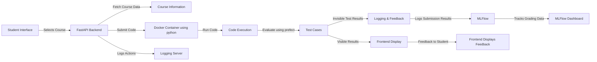

# Code Gym System Architecture

The **Code Gym** system is a modular, scalable, and interactive platform for students to practice programming. It integrates a frontend, backend, and several key components to deliver a seamless learning experience.

## Key Components

### 1. **Frontend (Flask)**
- **User-friendly Interface** for course selection, problem-solving, and real-time feedback.
  
### 2. **Backend (FastAPI)**
- **FastAPI** serves as the core, handling requests to fetch courses, submit code, and trigger the Docker container for evaluation.

### 3. **Docker Containers**
- **Isolated environments** for running student code (Python or JavaScript), ensuring security and consistency.

### 4. **Prefect Workflow**
- **Orchestrates** the grading process by running code in Docker, checking test cases, and logging results.

### 5. **MLFlow**
- **Tracks** grading metrics and student performance, logging data for future analysis.

## Data Flow

1. **Student selects** a course, topic, and problem via the frontend.
2. **Code is submitted** to the backend via FastAPI.
3. **Docker container** runs the code and evaluates it against test cases.
4. **Feedback is sent** back to the student through the frontend.
5. **Grading metrics** are logged using MLFlow for analysis.

---
## *System Architecture Diagram*

The following diagram illustrates the flow of data through the system:

---
